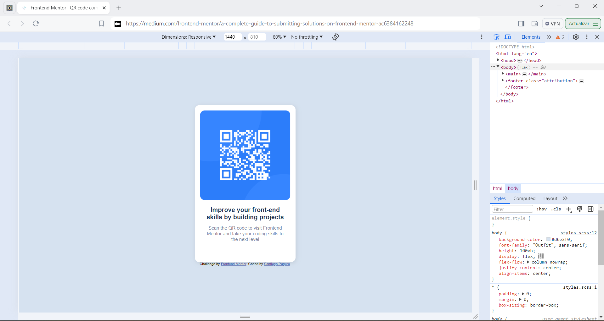
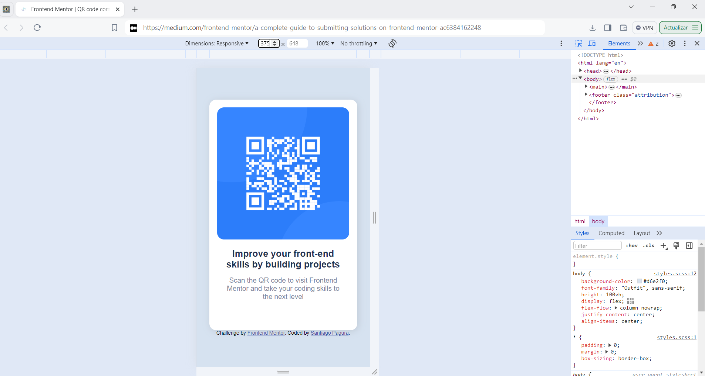

# Frontend Mentor - QR code component solution // Solución al componente de código QR

This is a solution to the [QR code component challenge on Frontend Mentor](https://www.frontendmentor.io/challenges/qr-code-component-iux_sIO_H). Frontend Mentor challenges help you improve your coding skills by building realistic projects. 

Esta es una solución al [Desafío de componentes de código QR en Frontend Mentor](https://www.frontendmentor.io/challenges/qr-code-component-iux_sIO_H). Los retos de Frontend Mentor te ayudan a mejorar tus habilidades de programación construyendo proyectos realistas. 

## Table of contents // Índice

- [Overview](#overview)
  - [Screenshot](#screenshot)
  - [Links](#links)
- [My process](#my-process)
  - [Built with](#built-with)
  - [What I learned](#what-i-learned)
  - [Continued development](#continued-development)
  - [Useful resources](#useful-resources)
- [Author](#author)
- [Acknowledgments](#acknowledgments)

- [Resumen](#resumen)
  - [Captura de pantalla](#screenshot)
  - [Enlaces](#links)
- [Mi proceso](#my-process)
  - [Construido con](#built-with)
  - [Lo que aprendí](#what-i-learned)
  - [Desarrollo continuo](#continued-development)
  - [Recursos útiles](#useful-resources)
- [Autor](#author)
- [Agradecimientos](#acknowledgments)

## Overview // Visión General

This project is a QR code component created as part of a challenge in Frontend Mentor. The goal of the challenge was to build a QR code component and improve frontend development skills.

Este proyecto es un componente de código QR creado como parte de un desafío en Frontend Mentor. El objetivo del reto era construir un componente de código QR y mejorar las habilidades de desarrollo frontend.

### Screenshot  //  Captura de pantalla

Screenshot / Captura de pantalla
 1440px

Screenshot / Captura de pantalla
 375px

Screenshot / Captura de pantalla
 320px

### Links

- Solution URL: [Add solution URL here](https://your-solution-url.com)
- Live Site URL: [Add live site URL here](https://your-live-site-url.com)

- URL de la solución: [Añada aquí la URL de la solución](https://your-solution-url.com)
- URL del sitio en vivo: [Añadir URL del sitio en vivo aquí](https://your-live-site-url.com)

## My process

### Built with  // Construido con 

- Semantic HTML5 markup
- CSS custom properties
- Flexbox
- Mobile-first workflow
- Google Fonts

### What I learned  // Lo que aprendí

In this project, I learned how to create a responsive design using flexbox, how to integrate custom fonts from Google Fonts and how to apply shadows and rounded edges with CSS.

En este proyecto aprendí a crear un diseño responsive usando flexbox, a integrar fuentes personalizadas de Google Fonts y a aplicar sombras y bordes redondeados con CSS.

### Continued development

In the future, I would like to improve my knowledge in CSS animations to add additional visual effects to the QR code component. 

En el futuro, me gustaría mejorar mis conocimientos en animaciones CSS para añadir efectos visuales adicionales al componente de código QR.

### Useful resources

- Google Fonts - To integrate the custom font used in the project.

## Author

- LinkedIn - (www.linkedin.com/in/spagura)
- Frontend Mentor - [@yourusername](https://www.frontendmentor.io/profile/yourusername)

## Acknowledgments

I thank Frontend Mentor for providing practical challenges to improve my frontend development skills.

